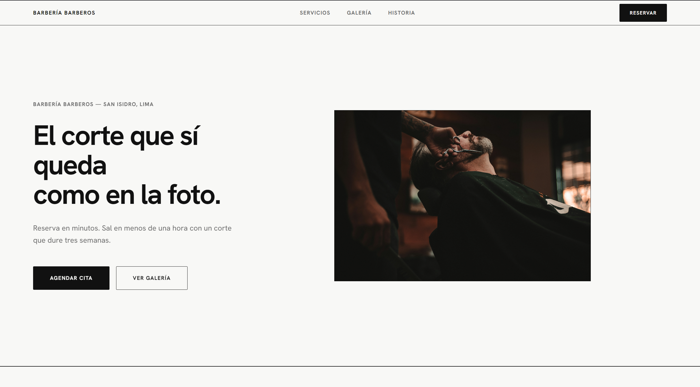

# Barbería Barberos

Landing page para una barbería en San Isidro, Lima. Cortes clásicos, arreglo de barba y experiencia premium desde S/ 65. Reserva en minutos, sal listo en menos de una hora.

---



---

## Tecnologías


---

## Características

- **Diseño minimalista** con paleta de 3 colores: negro, blanco y azul profundo
- **Secciones completas**: hero, servicios y precios, galería tipo bento grid, historia, testimonios y formulario de reserva
- **Animaciones** de scroll reveal, typewriter en el héroe y contadores animados
- **Formulario de contacto** integrado con Formspree y confirmación visual de envío
- **Menú responsive** con hamburguesa en móvil
- **Enlace directo a WhatsApp** como canal alternativo de reserva
- **SEO optimizado**: meta tags, Open Graph y Twitter Card configurados
- **Performance** con puntaje 100 en PageSpeed Insights

---

## Demo

🔗 [barberiabarberos.vercel.app](https://barberiabarberos.vercel.app/)

---

## Cómo ejecutar localmente

No requiere instalación ni dependencias. Es HTML estático puro.

**1. Clona el repositorio**
```bash
git clone https://github.com/tu-usuario/barberia-barberos.git
```

**2. Entra a la carpeta**
```bash
cd barberia-barberos
```

**3. Abre el proyecto**

Opción A — directamente en el navegador:
```bash
open index.html
```

Opción B — con Live Server (recomendado para ver los cambios en tiempo real):
- Instala la extensión [Live Server](https://marketplace.visualstudio.com/items?itemName=ritwickdey.LiveServer) en VS Code
- Clic derecho en `index.html` → *Open with Live Server*

---

## Estructura del proyecto

```
barberia-barberos/
├── index.html        # Estructura y contenido de la landing
├── scripts.js        # Animaciones, typewriter, contadores y formulario
├── foto-hero.jpg     # Imagen principal del hero
└── og-image.jpg      # Imagen para redes sociales (Open Graph)
```

---

## Licencia

Este proyecto es de uso privado. No está disponible para redistribución.
